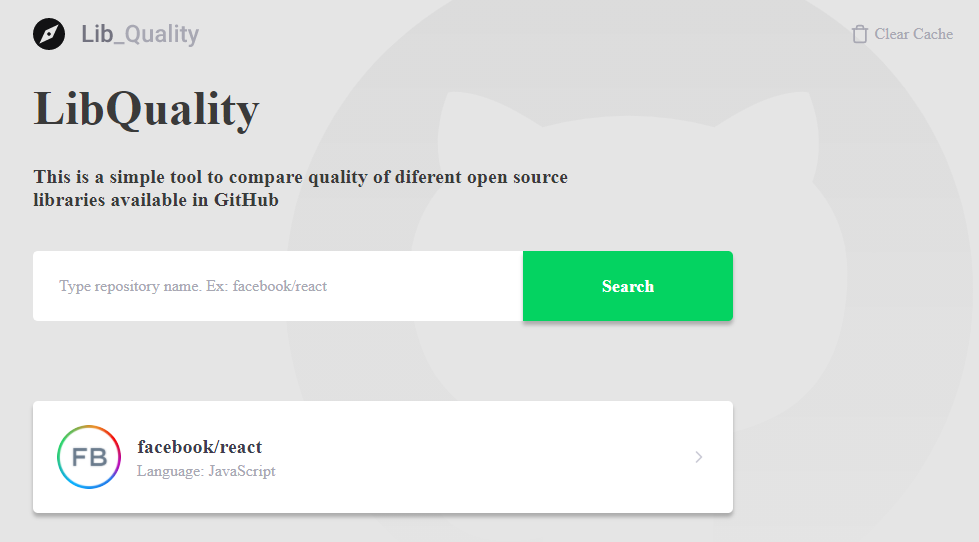

# LibQuality

* When the system as Online you will access the web-page at following andress:
  * [http://localhost:3000/](http://localhost:3000/)
  * You can make a new search at search field. 
    * You need inform the full name Ex: facebook/react \(owner/project name\).
  * After the search the project will appear like a list under the search field. To see the all statistics and graphs you should click on project box.

### Architecture, Technologies and Patterns.

this project was thought to grow health to fulfill new requirements. If need change any third-party the system already ready to be changed.

### The architecture:

* The front-end is ready to be exported to a any version of JavaScript. Was used TypeScript and React to resolve the scarcity of developers with knowledge of leged versions.
* In the same way, the back and are ready to be deployed. Was used TypeScript and Nodejs.
* The persistence of data are ready to grow up or be change. Today we use Postgres DB, but it's ready to accept \(MySQL / MariaDB / Postgres / CockroachDB / SQLite / Microsoft SQL Server / Oracle / SAP Hana / sql.js\). Or NOSQL MongoDB.

* \*\*We have a to-do point, is a lambda service or a microservice. To automate issues update caching the oldests and complete the graph. and with a cron schedule to run every day to update data.

### S.O.L.I.D principles / DDD and TDD.

#### Back-End

I applied the DDD \(Domain-Driven Design\), segmented through knowledge area \(module/archive\). Only to back-end.

I don't applied every concept of methodology. Every project has different features, and different moments.

I isolate the archiver through the domain knowledge area. We has the ISSUE module with two entities \(Repository and Issue\). Why? Well we don't need more than one module don't have any sense have \(issue\) without \(repository\). thinkhing throug this way i decided make then in one module.

Separate the business rule from the INFRA layer. which are the tools chosen to interact with the business rule layer. Ready to be changed. If necessary. We need to ensure that it works with another library, thinking about that we have created generic repositories that can be linked to any library of this type.

Dependency Inversion Principle: instead of my repository know what the repository format are dealing. We pass this responsibility to the routes. Applying the interface and ensuring the L of solid. Basicly.

