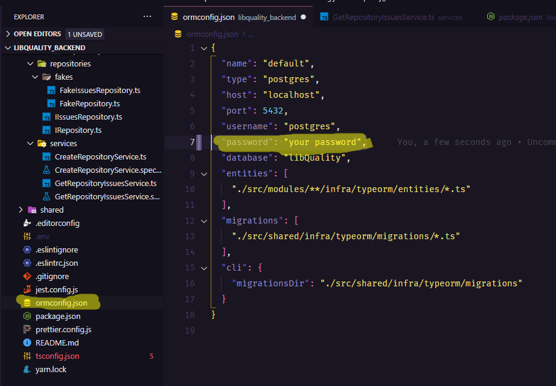

# LibQuality

* When the system as Online you will access the web-page at following andress:
  * [http://localhost:3000/](http://localhost:3000/)
  * You can make a new search at search field. 
    * You need inform the full name Ex: facebook/react \(owner/project name\).
  * After the search the project will appear like a list under the search field. To see the all statistics and graphs you should click on project box.

## Architecture, Technologies and Patterns.

this project was thought to grow health to fulfill new requirements. If need change any third-party the system already ready to be changed.

### The architecture:

* The front-end is ready to be exported to a any version of JavaScript. Was used TypeScript and React to resolve the scarcity of developers with knowledge of leged versions.
* In the same way, the back and are ready to be deployed. Was used TypeScript and Nodejs.
* The persistence of data are ready to grow up or be change. Today we use Postgres DB, but it's ready to accept \(MySQL / MariaDB / Postgres / CockroachDB / SQLite / Microsoft SQL Server / Oracle / SAP Hana / sql.js\). Or NOSQL MongoDB.

* \*\*We have a to-do point, is a lambda service or a microservice. To automate issues update caching the oldests and complete the graph. and with a cron schedule to run every day to update data.

### S.O.L.I.D principles / DDD and TDD.

#### Back-End

I applied the DDD \(Domain-Driven Design\), segmented through knowledge area \(module/archive\). Only to back-end.

I don't applied every concept of methodology. Every project has different features, and different moments.

I isolate the archiver through the domain knowledge area. We has the ISSUE module with two entities \(Repository and Issue\). Why? Well we don't need more than one module don't have any sense have \(issue\) without \(repository\). thinkhing throug this way i decided make then in one module.

Separate the business rule from the INFRA layer. which are the tools chosen to interact with the business rule layer. Ready to be changed. If necessary. We need to ensure that it works with another library, thinking about that we have created generic repositories that can be linked to any library of this type.

Dependency Inversion Principle: instead of my repository know what the repository format are dealing. We pass this responsibility to the routes. Applying the interface and ensuring the L of solid. Basicly.

### Libraries:

* Axios: Promise based HTTP client for the browser and node.js
* Cors: Node.js CORS middleware.
* Date-fns: Modern JavaScript date utility library.
* Dotenv: Loads environment variables from .env file.
* Express: Fast, unopinionated, minimalist web framework. REST.
* Math-stats: Statistics for your numbers.
* Pg: PostgreSQL client - pure javascript & libpq with the same API.
* Reflect-metadata: Polyfill for Metadata Reflection API.
* Tsyringe: Lightweight dependency injection container for JavaScript/TypeScript.
* Typeorm: Data-Mapper ORM for TypeScript, ES7, ES6, ES5. Supports MySQL, PostgreSQL, MariaDB, SQLite, MS SQL Server, Oracle, MongoDB databases.
* Uuid: RFC4122 \(v1, v4, and v5\) UUIDs.

### Front-End

The front-end was build with react with out frameworks, i segmented every page with your component and stylesheet writed with styled components. Ready to grow.

### Data Base

I chose the TypeORM to be a Data-Mapper ORM. Per many factors. Security \(this library has many protocol to improve communications behind the scenes\). Which reduces human error and openings for sql inject. And the better thens is the possibility the change the database vendor.

## Getting Start

1. You should be have the LTS version of the node.
   1. [https://nodejs.org/en/](https://nodejs.org/en/)
      1. Ex: 12.18.3 LTS
2. After the node js install, you should be install the yarn Package Manager
   1. npm install -g yarn
3. You need the docker on you computer.
   1. [https://www.docker.com/get-started](https://www.docker.com/get-started)
   2. You should run this command on command line interface with access to docker \( docker run --name some-postgres -e POSTGRES\_PASSWORD=**mysecretpassword** -d postgres \)
      1. You must have change the password and input then on JSON file to back end access the postgres.
4. **You need clone the back end project:**

   1. [https://github.com/Fernandoaml/LibQuality\_BackEnd/](https://github.com/Fernandoaml/LibQuality_BackEnd/)
   2. Go to the folder and on command line interface you must be run this command: **yarn**

   \*\*\*\*

   1. Now we will change the typeorm credentials. As it is a JSON file, we will need to change the values. And for that reason, we did not implement it for them .env file  .   
   2. We need change the name of the file **.env copy** to **.env.**
      1. We need insert the Github api key **USER\_AND\_KEY\_API="githubusername:apikeyhere"**  
   3. **After run: yarn typeorm migration:run** 
   4. **After run: yarn dev:server**

   \*\*\*\*

5. **You need clone the front end project:**
   1. [https://github.com/Fernandoaml/LibQuality\_FrontEnd](https://github.com/Fernandoaml/LibQuality_FrontEnd)
   2. Go to the folder and on command line interface you must be run this command: **yarn**
   3. **After run: yarn start**
   4. Access the front end 
      * [http://localhost:3000/](http://localhost:3000/)

## **Tests:**

* **Back End:**
  * To Back end i used the JEST to make the TDD aplying unity tests
  * If you're with command line opened, you must open a new interface of command line in the same folder and run the next command.
    * **yarn test**

* **To see the coverage report \(Lcov-report\) you need to open the following file**:
  * \libquality\_backend\coverage\lcov-report\index.html

* **Front End:**
  * I will implement the test with Cypress library.
  * ....

