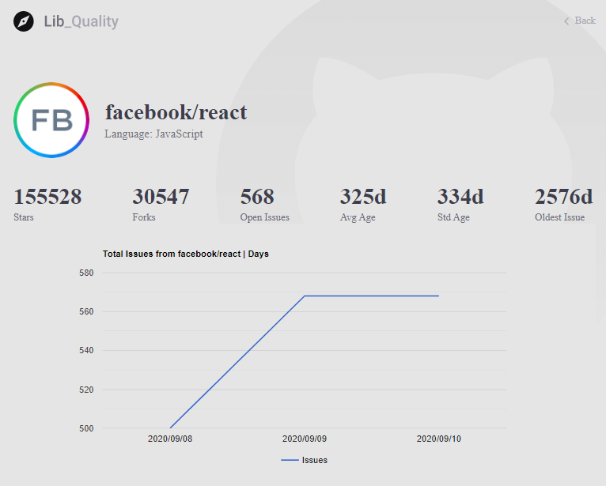

# LibQuality

* When the system as Online you will access the web-page at following andress:
  * [http://localhost:3000/](http://localhost:3000/)
  * You can make a new search at search field. 
    * You need inform the full name Ex: facebook/react \(owner/project name\).
  * After the search the project will appear like a list under the search field. To see the all statistics and graphs you should click on project box.

