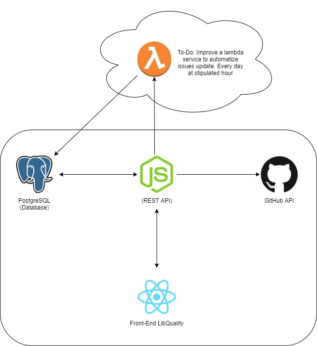

# Architecture, Technologies and Patterns.

### The architecture:

* The front-end is ready to be exported to a any version of JavaScript. Was used TypeScript and React to resolve the scarcity of developers with knowledge of leged versions.
* In the same way, the back and are ready to be deployed. Was used TypeScript and Nodejs.
* The persistence of data are ready to grow up or be change. Today we use Postgres DB, but it's ready to accept \(MySQL / MariaDB / Postgres / CockroachDB / SQLite / Microsoft SQL Server / Oracle / SAP Hana / sql.js\). Or NOSQL MongoDB.

* We have a to-do point, is a lambda service or a microservice. To automate issues update caching the oldests and complete the graph. and with a cron schedule to run every day to update data.

